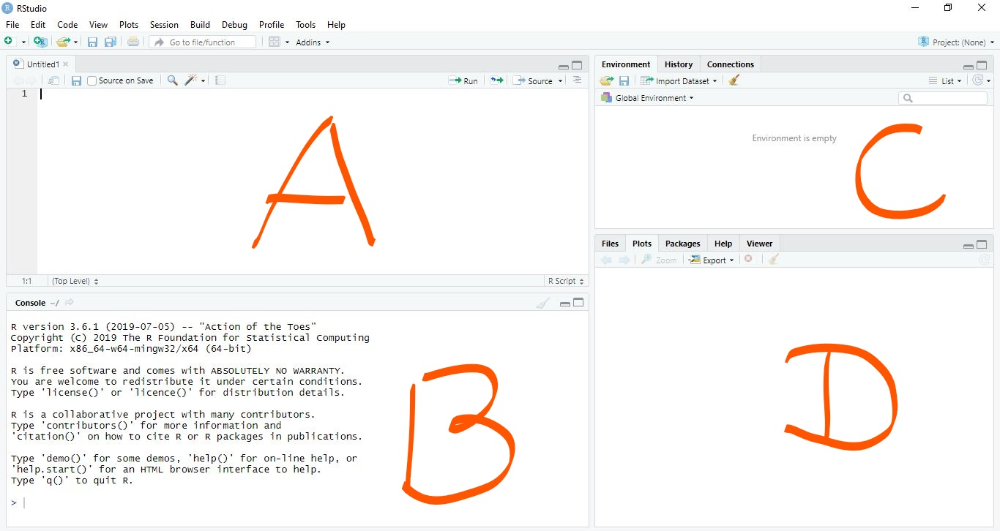
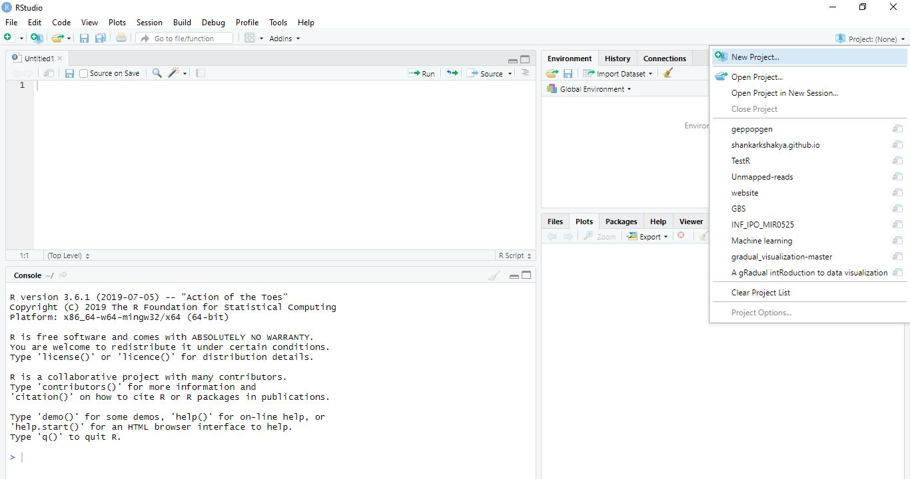

---

---

## What is R and why R?

R is a free statistical programming language. It has been widely used for statistics, data analysis and data visualization. One of the fields where R is widely used is genomics. Many R packages have been developed for population genetics data analyses and visualization.

### Installing R and Rstudio

Download and install [R](http://cran.r-project.org/) and [RStudio](http://www.rstudio.com/). 
if you do not have them already. Rstudio is optional but it is a great tool if you are just starting to learn R.
Once you have download and installed R and Rstudio, we ll start working by creating project.


Now open Rstudio. We ll learn couple of basic things.

1. Under whats in different panes in Rstudio.
2. We ll learn how to create an R project directory.
3. We ll learn how to use base functions and later how to install packages.
4. What are packages and how is it useful etc.


## Rstudio



We ll talk about these 4 distinct panes.


## Creating new project directory

Once you are inside Rstudio you can click on your top right where it says project to create a new project. By doing this you ll have all your data and script in one location.




Now we can start working in Rstudio but before we go ahead and start writing scripts we can even work in our console. 

In the console type getwd() and see what happens.

### R as calculator

```{r}

# Add

5+10

# Substract

10-5 

# Multiply
5 * 10


# Divide
100 / 5


```

### R data structures

## Vectors

A vector can contain either number, strings, or logical values but not a mixture.

```{r}

x <- 100
x

x <- c(1,3,2,10,5)

str(x)
class(x)

# Selecting elements from vector

x[3]

```


## Basic statistics

```{r}

mean(x)
median(x)
sd(x)
var(x)


## See what summary command does
summary(x)

```

## List

List can hold different types of data structures.

```{r}

mylist <- list(name="Fred",
       mynumbers=c(1,2,3),
       mymatrix=matrix(1:4,ncol=2),
       age=5.3)
mylist

## access using $ sign.
mylist$name

```


## Matrix

Matrix is vector but with dimension.

```{r}

x <- c(1,2,3,4)
y <- c(4,5,6,7)
matrix <- cbind(x,y)
mymat <- matrix(NA, nrow = 2, ncol = 2)

```


## Logicals

```{r}

```


## Data frame

```{r}

chr <- c("chr1", "chr1", "chr2", "chr2")
strand <- c("-","-","+","+")
start <- c(200,4000,100,400)
end <- c(250,410,200,450)
mydata <- data.frame(chr,start,end,strand)

head(mydata)

#change column names

names(mydata) <- c("Chromosome","Start_position","End_position","Strand")
mydata 

head(mydata)
tail(mydata)
nrow(mydata)
ncol(mydata)

dim(mydata)

## Save csv file
#write.csv(x = mydata, file = "mydata.csv")

```

## Reading data into R

For this part, we ll use the workshop material developed by Dr. Sydney E. Everhart's lab at University of Nebraska, Lincoln.

[Intro to R](https://everhartlab.github.io/APS_IntroR_2019/index.html)
