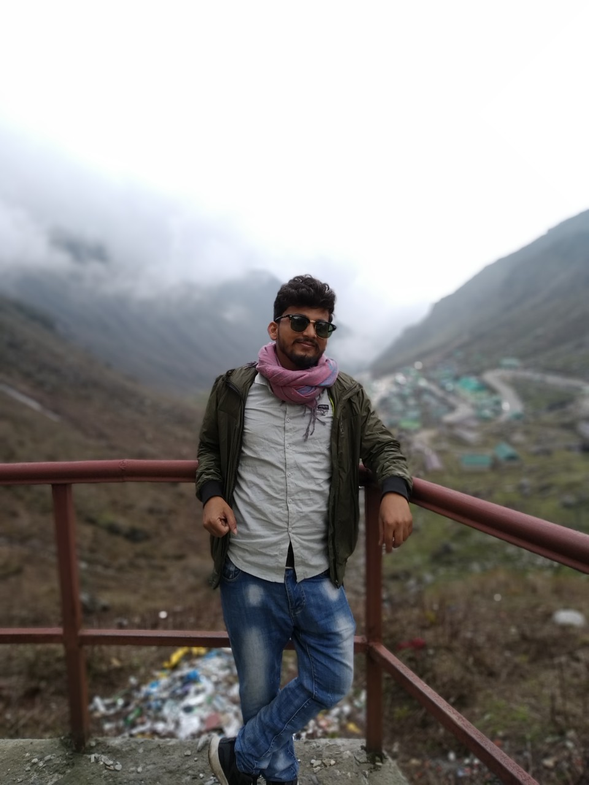
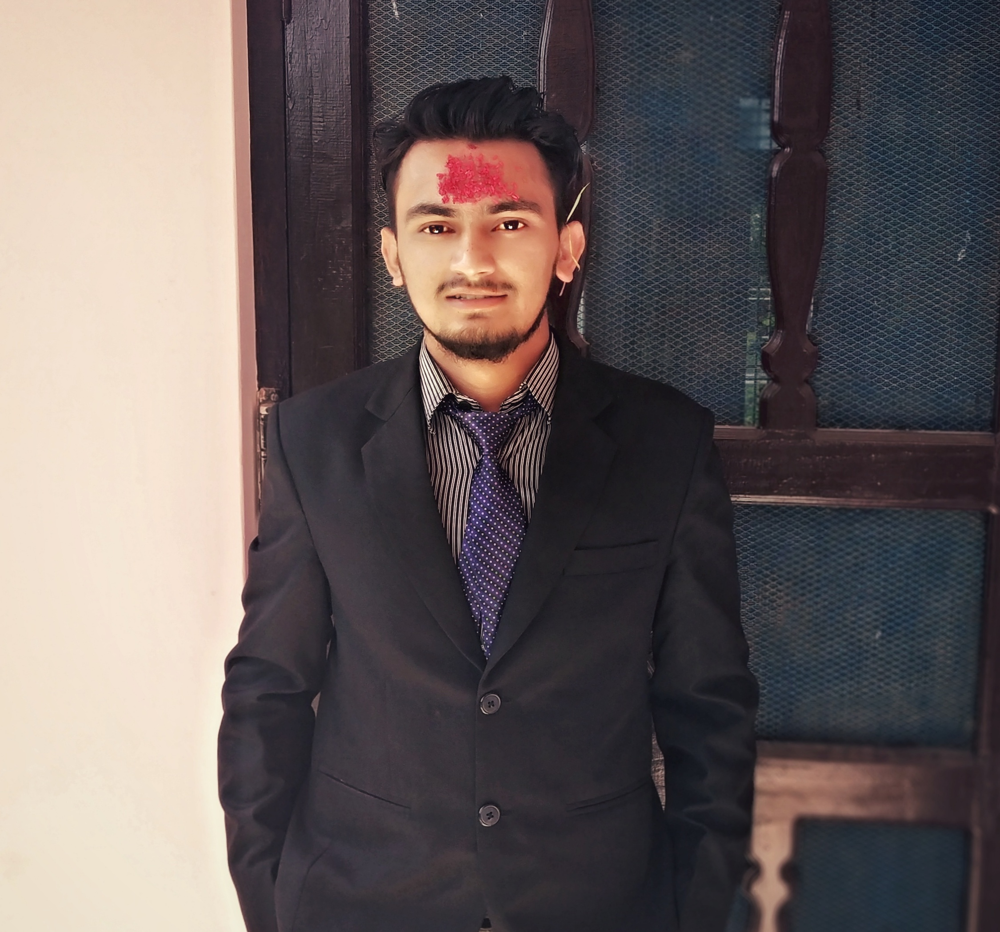
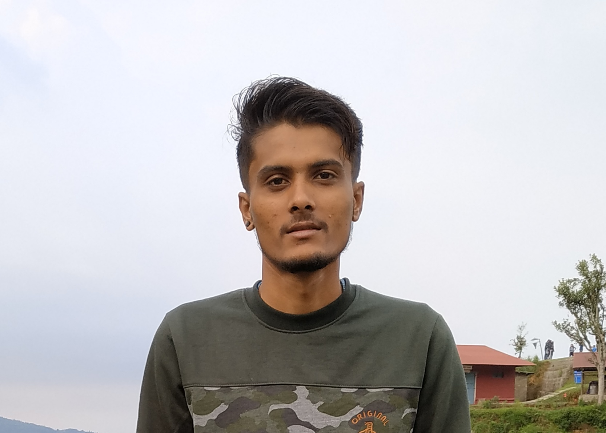

---
editor_options:
  chunk_output_type: console
---

```{r setup, include=FALSE}
knitr::opts_chunk$set(echo = TRUE)
```


### Anup Paudyal


### Dhirendra



### Bikash Poudel


### Lalit BC


### Narendara Chand


### Prabina Acharya


### Pushpa Gyawali


### Sangam Bhattarai


### Sapana Gotame


### Sapana Thapa


### Suraj Poudel



